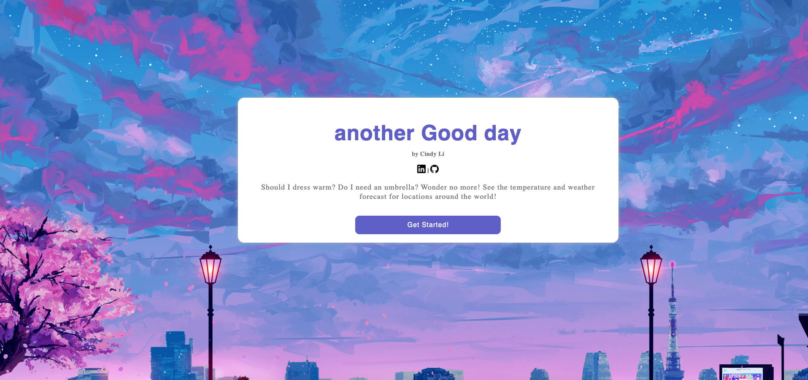

# another-goodday

another Good day is a weather tracking website that allows users to search and view the current weather condition of anywhere in the world. Users can search for any locations and able to see the local time and local weather condititon for today as well as for next four days.

[Live Site](https://cindy803.github.io/another-goodday/)

## Technologies:
* JavaScript
* HTML5
* CSS 

## Features / Functionalities
* An introduction modal to briefly describe the website 
* Users can search for any locations to view the current weather condition 
* Users can view the current local dates and times 
* Users can view the weather condition for next four days 
* background and weather emojis change as the weather condition changes

